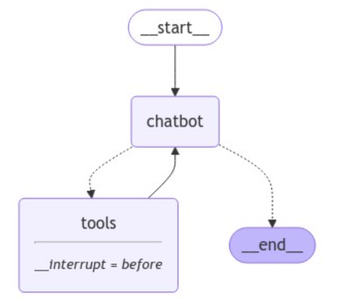

# Quick Start

在这个完整的快速入门中，我们将用LangGraph构建一个支持各种功能的机器人，它能：
- 通过搜索网页回答常见问题
- 保持在调用中的对话状态（state)
- 传送复杂的查询给人工审查
- 用自定义的状态state控制它的行为
- 回溯和探索其他备选的对话路径

我们将从一个基本的聊天机器人开始，逐步增加更复杂的功能，引入关键的LangGraph概念。

## 准备

首先，初始化依赖包：

```bash
%%capture --no-stderr
%pip install -U langgraph langsmith langchain_anthropic
```

接着, 设置你的 API keys:


```python
import getpass
import os


def _set_env(var: str):
    if not os.environ.get(var):
        os.environ[var] = getpass.getpass(f"{var}: ")


_set_env("ANTHROPIC_API_KEY")
ANTHROPIC_API_KEY:  ········
```

设置 [LangSmith](https://smith.langchain.com/)  LangGraph 开发模式（非必须，先不翻译）

Sign up for LangSmith to quickly spot issues and improve the performance of your LangGraph projects. LangSmith lets you use trace data to debug, test, and monitor your LLM apps built with LangGraph — read more about how to get started [here](https://docs.smith.langchain.com/).


## Part 1: 创建一个基础的聊天机器人
我们将用LangGraph创建一个简单的聊天机器人。这个机器人将直接返回用户消息。虽然简单，但是它将阐明创建LangGraph的核心概念。通过该章节最后，你将有一个基本的聊天机器人。

开始创建一个 `StateGraph`.  `StateGraph` 对象定义了我们的聊天机器人作为一个“状态机器”的结构。我们将添加`节点`来表示我们的聊天机器人可以调用大模型（llm）和函数（functions），并添加“边”来指定机器人应该如何在这些函数之间切换（调用）。


```python
from typing import Annotated

from typing_extensions import TypedDict

from langgraph.graph import StateGraph, START, END
from langgraph.graph.message import add_messages


class State(TypedDict):
    # Messages have the type "list". The `add_messages` function
    # in the annotation defines how this state key should be updated
    # (in this case, it appends messages to the list, rather than overwriting them)
    messages: Annotated[list, add_messages]


graph_builder = StateGraph(State)
```

注意

> 当你一开始定义了一个graph就意味着定义了这个graph的状态(state)，这个`状态`包含了graph的schema以及reducer 函数，这些reducer 函数规定了如何将更新内容应用到状态（state）上。在我们的例子中，`State`是带有单独key（messages）的 `TypedDict`，这个  `messages` keys是一个带有 [`add_messages`](https://langchain-ai.github.io/langgraph/reference/graphs/?h=add+messages#add_messages) 的注解（annotated）的reducer 函数，它将告诉LangGraph 追加mesage到已经存在的消息列表上，而不是覆盖。没有注解的`state`键将被每次更新覆盖，存储最近的值，查阅[这个概念说明](https://langchain-ai.github.io/langgraph/reference/graphs/?h=add+messages#add_messages) 学习更多关于状态state，reducers和其他的基本概念。


所以现在我们的graph清楚了2件事：

1. 我们定义的每一个节点（node）都会接收当前的状态（state）作为输入和修改了状态state值作为输出。
2. 消息（messages)将会追加到当前的列表中，而不是直接覆盖。这是通过预先构建的`Annotated` 语法[`add_messages`](https://langchain-ai.github.io/langgraph/reference/graphs/?h=add+messages#add_messages)函数。

接下来，添加一个 "`chatbot`" 节点.节点代表工作单元，这是一个典型的常规python函数。

```python
from langchain_anthropic import ChatAnthropic

llm = ChatAnthropic(model="claude-3-5-sonnet-20240620")


def chatbot(state: State):
    return {"messages": [llm.invoke(state["messages"])]}


# The first argument is the unique node name
# The second argument is the function or object that will be called whenever
# the node is used.
graph_builder.add_node("chatbot", chatbot)
```

**注意** `chatbot`节点函数怎样携带当前 `State` 作为输入并返回一个字典dictionary，字典内包含key="messages"是更新过的`messages` 列表。这是所有LangGraph节点函数的基本模式。


在状态（state）中追加大模型返回的消息，无论这个消息是否已经存在在state里面，这就是在我们的这个`add_messages` 函数的功能。


接下来，我们添加一个`entry`（入口）点，这是告诉图（Graph）每次运行的时候**从哪里开始**。


```python
graph_builder.add_edge(START, "chatbot")
```

同样，设置一个`finish`（结束） 点。这是graph**"在节点运行的任何时候，你都可以结束"**的指令。


```python
graph_builder.add_edge("chatbot", END)
```

最后，我们想要运行我们的graph，这么做，调用graph builder的"`compile()`" 函数。这就是创建 "`CompiledGraph（编译过的graph）`"我们可以在我们的state上调用。


```python
graph = graph_builder.compile()
```

你可以可视化的看到graph的样子，用像是`draw_ascii` 或 `draw_png`库的 `get_graph` 方法和其中一个"draw"方法

```python
from IPython.display import Image, display

try:
    display(Image(graph.get_graph().draw_mermaid_png()))
except Exception:
    # This requires some extra dependencies and is optional
    pass
```


现在开始运行这个聊天机器人吧！

Tip: 你可以在任何时候使用键盘 "quit", "exit", or "q",结束聊天循环。

```python
def stream_graph_updates(user_input: str):
    for event in graph.stream({"messages": [("user", user_input)]}):
        for value in event.values():
            print("Assistant:", value["messages"][-1].content)


while True:
    try:
        user_input = input("User: ")
        if user_input.lower() in ["quit", "exit", "q"]:
            print("Goodbye!")
            break

        stream_graph_updates(user_input)
    except:
        # fallback if input() is not available
        user_input = "What do you know about LangGraph?"
        print("User: " + user_input)
        stream_graph_updates(user_input)
        break
           
```

小助手提示：LangGraph是一个用大语言模型帮助构建有状态的多agent应用的框架。它提供了创建工作流程和状态机的工具，来协调AI agent 或者大语言模型的交互。langgraph建立在langchain之上，利用其组件并添加了基于grahp的协调能力。LangGraph对开发复杂、有状态的，不仅仅是简单的查询-响应式的交互应用是特别有用。
再见

**恭喜!** 你已经用LangGraph创建了你的第一个聊天机器人。这个机器人能通过聊天用户的输入和大模型生成响应参与基础对话 .你可以在提供的链接中检查调用的 [LangSmith 轨迹](https://smith.langchain.com/public/7527e308-9502-4894-b347-f34385740d5a/r) 。


然而，你可能已经注意到了这个机器人的知识受限于它自己的训练数据.在下一章节，我们将添加网络搜索工具（web search tool）来扩展机器人的知识库并使它更加强大。

下面的是这个章节的完整代码供你参考：
```python
from typing import Annotated

from langchain_anthropic import ChatAnthropic
from typing_extensions import TypedDict

from langgraph.graph import StateGraph
from langgraph.graph.message import add_messages


class State(TypedDict):
    messages: Annotated[list, add_messages]


graph_builder = StateGraph(State)


llm = ChatAnthropic(model="claude-3-5-sonnet-20240620")


def chatbot(state: State):
    return {"messages": [llm.invoke(state["messages"])]}


# The first argument is the unique node name
# The second argument is the function or object that will be called whenever
# the node is used.
graph_builder.add_node("chatbot", chatbot)
graph_builder.set_entry_point("chatbot")
graph_builder.set_finish_point("chatbot")
graph = graph_builder.compile()

```

## Part 2: 用工具增强聊天机器人

为了处理用户输入消息，我们的聊天机器人不能凭"记忆"回答，我们将整合一个联网搜索工具。
我们的机器人能用这个工具就能发现相关的信息和提供好的回答。
### 前置要求
在开始之前，确保你已经安装好了必要依赖包和准备好API的keys.
首先，用 [Tavily Search Engine](https://python.langchain.com/docs/integrations/tools/tavily_search/)初始化这些依赖包，并设置你的[TAVILY_API_KEY](https://tavily.com/).

```bash
%%capture --no-stderr
%pip install -U tavily-python langchain_community
```


```python
_set_env("TAVILY_API_KEY")
TAVILY_API_KEY:  ········
```

接下来，定义这个工具：
```python
from langchain_community.tools.tavily_search import TavilySearchResults

tool = TavilySearchResults(max_results=2)
tools = [tool]
tool.invoke("What's a 'node' in LangGraph?")
```
```json
[{'url': 'https://medium.com/@cplog/introduction-to-langgraph-a-beginners-guide-14f9be027141',
  'content': 'Nodes: Nodes are the building blocks of your LangGraph. Each node represents a function or a computation step. You define nodes to perform specific tasks, such as processing input, making ...'},
 {'url': 'https://saksheepatil05.medium.com/demystifying-langgraph-a-beginner-friendly-dive-into-langgraph-concepts-5ffe890ddac0',
  'content': 'Nodes (Tasks): Nodes are like the workstations on the assembly line. Each node performs a specific task on the product. In LangGraph, nodes are Python functions that take the current state, do some work, and return an updated state. Next, we define the nodes, each representing a task in our sandwich-making process.'}]
```

这个返回结果是我们的聊天机器人能回答问题的页面总结。


接下来，我们开始定义我们的Graph。除了我们增加了绑定工具到大模型上，之后都是与第一张（Part 1）相同的操作。如果大模型想使用我们的搜索引擎，这个操作就让大模型知道正确使用JSON格式。

```python
from typing import Annotated

from langchain_anthropic import ChatAnthropic
from typing_extensions import TypedDict

from langgraph.graph import StateGraph, START, END
from langgraph.graph.message import add_messages


class State(TypedDict):
    messages: Annotated[list, add_messages]


graph_builder = StateGraph(State)


llm = ChatAnthropic(model="claude-3-5-sonnet-20240620")
# Modification: tell the LLM which tools it can call
llm_with_tools = llm.bind_tools(tools)


def chatbot(state: State):
    return {"messages": [llm_with_tools.invoke(state["messages"])]}


graph_builder.add_node("chatbot", chatbot)
```

下面，如果这些工具被调用到的时候，我们需要创建一个函数去真正的运行它们。我们将把这些工具添加到一个新的节点（node）中。

接着，我们将实现一个基本工具节点`BasicToolNode`，用于在状态（state）中检查最近的消息，并且如果消息中（llm 返回的）包含tool_calls ,就能调用这些工具。当然这依赖大模型对工具调用（tool_calling）的支持，目前Anthropic, OpenAI, Google Gemini，大部分大语言模型都能支持。

我们之后将用LangGraph的预构建工具节点来替换它，以加快速度，但是我们首先自己构建是有指导意义的，能让我们更明白其中原理。
```python
import json

from langchain_core.messages import ToolMessage


class BasicToolNode:
    """A node that runs the tools requested in the last AIMessage."""

    def __init__(self, tools: list) -> None:
        self.tools_by_name = {tool.name: tool for tool in tools}

    def __call__(self, inputs: dict):
        if messages := inputs.get("messages", []):
            message = messages[-1]
        else:
            raise ValueError("No message found in input")
        outputs = []
        for tool_call in message.tool_calls:
            tool_result = self.tools_by_name[tool_call["name"]].invoke(
                tool_call["args"]
            )
            outputs.append(
                ToolMessage(
                    content=json.dumps(tool_result),
                    name=tool_call["name"],
                    tool_call_id=tool_call["id"],
                )
            )
        return {"messages": outputs}


tool_node = BasicToolNode(tools=[tool])
graph_builder.add_node("tools", tool_node)
```
通过对节点的添加，我们定义了条件边`conditional_edges`。

Recall that edges route the control flow from one node to the next. Conditional edges usually contain "if" statements to route to different nodes depending on the current graph state. These functions receive the current graph state and return a string or list of strings indicating which node(s) to call next.

回想一下，边（edge）规划了一个节点到下一个节点的控制流程。条件边通常包含`if`表达式，依赖graph的当前状态`state`发送到不同的节点。这些函数接收当前graph的state，并返回一个字符串或字符串集合来指明下一个应该调用的节点。


下面，调用定义一个名为route_tools的路由函数，它用来检查聊天机器人输出的`tool_calls `。通过调用add_conditional_edges为graph提供此函数，它告诉graph每当聊天机器人节点完成检查该函数来查看下一步去。

如果调用工具存在，这个条件将会发送到工具，否则结束。

之后，为了更简单明了，我们将用预发布tools_condition来替换，但是首先自己来实现将会更加透彻。

```python
from typing import Literal


def route_tools(
    state: State,
):
    """
    Use in the conditional_edge to route to the ToolNode if the last message
    has tool calls. Otherwise, route to the end.
    """
    if isinstance(state, list):
        ai_message = state[-1]
    elif messages := state.get("messages", []):
        ai_message = messages[-1]
    else:
        raise ValueError(f"No messages found in input state to tool_edge: {state}")
    if hasattr(ai_message, "tool_calls") and len(ai_message.tool_calls) > 0:
        return "tools"
    return END


# The `tools_condition` function returns "tools" if the chatbot asks to use a tool, and "END" if
# it is fine directly responding. This conditional routing defines the main agent loop.
graph_builder.add_conditional_edges(
    "chatbot",
    route_tools,
    # The following dictionary lets you tell the graph to interpret the condition's outputs as a specific node
    # It defaults to the identity function, but if you
    # want to use a node named something else apart from "tools",
    # You can update the value of the dictionary to something else
    # e.g., "tools": "my_tools"
    {"tools": "tools", END: END},
)
# Any time a tool is called, we return to the chatbot to decide the next step
graph_builder.add_edge("tools", "chatbot")
graph_builder.add_edge(START, "chatbot")
graph = graph_builder.compile()
```

**注意** 条件边从一个单独的节点开始。这告诉graph，每当聊天机器人节点运行时，如果调用工具，将会去调用’tools‘，如果它直接响应，则结束循环。


像预建的“tools_condition”一样，如果没有工具调用，我们的函数将返回“END”字符串。当graph 识别到了`END`,就表示它没有更多的任务要完成并停止执行。因为条件能返回`END`，所以这时我们不需要明确的设置一个`finish_point`，我们的graph已经有了结束的方式。

为了可视化我们已经创建的graph，下面的函数有一些额外的依赖来运行，这些依赖对本教程来说并不是很重要。

```python
from IPython.display import Image, display

try:
    display(Image(graph.get_graph().draw_mermaid_png()))
except Exception:
    # This requires some extra dependencies and is optional
    pass
```


现在我们可以问一些不在与训练过的数据内的相关问题了。

```python
while True:
    try:
        user_input = input("User: ")
        if user_input.lower() in ["quit", "exit", "q"]:
            print("Goodbye!")
            break

        stream_graph_updates(user_input)
    except:
        # fallback if input() is not available
        user_input = "What do you know about LangGraph?"
        print("User: " + user_input)
        stream_graph_updates(user_input)
        break
```

```
Assistant: [{'text': "To provide you with accurate and up-to-date information about LangGraph, I'll need to search for the latest details. Let me do that for you.", 'type': 'text'}, {'id': 'toolu_01Q588CszHaSvvP2MxRq9zRD', 'input': {'query': 'LangGraph AI tool information'}, 'name': 'tavily_search_results_json', 'type': 'tool_use'}]
Assistant: [{"url": "https://www.langchain.com/langgraph", "content": "LangGraph sets the foundation for how we can build and scale AI workloads \u2014 from conversational agents, complex task automation, to custom LLM-backed experiences that 'just work'. The next chapter in building complex production-ready features with LLMs is agentic, and with LangGraph and LangSmith, LangChain delivers an out-of-the-box solution ..."}, {"url": "https://github.com/langchain-ai/langgraph", "content": "Overview. LangGraph is a library for building stateful, multi-actor applications with LLMs, used to create agent and multi-agent workflows. Compared to other LLM frameworks, it offers these core benefits: cycles, controllability, and persistence. LangGraph allows you to define flows that involve cycles, essential for most agentic architectures ..."}]
Assistant: Based on the search results, I can provide you with information about LangGraph:

1. Purpose:
   LangGraph is a library designed for building stateful, multi-actor applications with Large Language Models (LLMs). It's particularly useful for creating agent and multi-agent workflows.

2. Developer:
   LangGraph is developed by LangChain, a company known for its tools and frameworks in the AI and LLM space.

3. Key Features:
   - Cycles: LangGraph allows the definition of flows that involve cycles, which is essential for most agentic architectures.
   - Controllability: It offers enhanced control over the application flow.
   - Persistence: The library provides ways to maintain state and persistence in LLM-based applications.

4. Use Cases:
   LangGraph can be used for various applications, including:
   - Conversational agents
   - Complex task automation
   - Custom LLM-backed experiences

5. Integration:
   LangGraph works in conjunction with LangSmith, another tool by LangChain, to provide an out-of-the-box solution for building complex, production-ready features with LLMs.

6. Significance:
   LangGraph is described as setting the foundation for building and scaling AI workloads. It's positioned as a key tool in the next chapter of LLM-based application development, particularly in the realm of agentic AI.

7. Availability:
   LangGraph is open-source and available on GitHub, which suggests that developers can access and contribute to its codebase.

8. Comparison to Other Frameworks:
   LangGraph is noted to offer unique benefits compared to other LLM frameworks, particularly in its ability to handle cycles, provide controllability, and maintain persistence.

LangGraph appears to be a significant tool in the evolving landscape of LLM-based application development, offering developers new ways to create more complex, stateful, and interactive AI systems.
Goodbye!
```

**恭喜!** 你已经用langgraph创建了一个可以在需要时利用搜索引擎检索更新信息的对话功能的agent了。现在它能处理更广泛的问题输入了，为了检查agent的整个步骤，你仅仅需要查看[LangSmith 轨迹](https://smith.langchain.com/public/4fbd7636-25af-4638-9587-5a02fdbb0172/r).


我们的聊天机器人任然不能记住它自己过往的交互信息，限制了它自己的连贯性，多轮对话。在下一章，我们将通过添加**记忆**功能来解决这一问题。


我们在这一章节已经创建了graph完整代码如下所示，用与构建的 [ToolNode](https://langchain-ai.github.io/langgraph/reference/prebuilt/#toolnode)替换我们自己的`BasicToolNode` ，并且用预构建的[tools_condition](https://langchain-ai.github.io/langgraph/reference/prebuilt/#tools_condition)替换我们自己的`route_tools` 。

### 完整代码：

```python
from typing import Annotated

from langchain_anthropic import ChatAnthropic
from langchain_community.tools.tavily_search import TavilySearchResults
from langchain_core.messages import BaseMessage
from typing_extensions import TypedDict

from langgraph.graph import StateGraph
from langgraph.graph.message import add_messages
from langgraph.prebuilt import ToolNode, tools_condition


class State(TypedDict):
    messages: Annotated[list, add_messages]


graph_builder = StateGraph(State)


tool = TavilySearchResults(max_results=2)
tools = [tool]
llm = ChatAnthropic(model="claude-3-5-sonnet-20240620")
llm_with_tools = llm.bind_tools(tools)


def chatbot(state: State):
    return {"messages": [llm_with_tools.invoke(state["messages"])]}


graph_builder.add_node("chatbot", chatbot)

tool_node = ToolNode(tools=[tool])
graph_builder.add_node("tools", tool_node)

graph_builder.add_conditional_edges(
    "chatbot",
    tools_condition,
)
# Any time a tool is called, we return to the chatbot to decide the next step
# 任何时候一个工具被调用，我们将返回给聊天机器人来决定下一个步骤
graph_builder.add_edge("tools", "chatbot")
graph_builder.set_entry_point("chatbot")
graph = graph_builder.compile()
```

## Part 3: 给聊天机器人添加记忆功能
官方文档：[第三章、给机器人添加记忆功能](https://langchain-ai.github.io/langgraph/tutorials/introduction/#part-3-adding-memory-to-the-chatbot)

现在，我们的机器人能用工具回答用户的问题了，但是它还不能记住上一个对话的上下文。这限制了它的连贯能力、多轮对话能力。

LangGraph 为了解决这一问题抛出了 **persistent checkpointing(保持切入点)**的概念。如果当你在编译graph时提供了一个`checkpointer`(切入点)和你调用graph的时候添加一个`thread_id`（线程id）,LangGraph会在每一个步骤之后自动保存当前状态state.当你再次调用graph的时候，使用同样的`thrad_id`(线程id)，graph会加载它自己保存的状态，允许聊天机器人从断开的地方重新开始。


我们稍后会看到切入点checkpointing比简单聊天记忆要强大得多——它能让你在任何时候保存和恢复发展的状态state，可以实现错误修复，人工介入流程，time travel（TODO注：这是什么功能？？后面研究透彻后再补充） 交互等等。但是我们在实现这些超强功能之前，先添加`checkpointing`和支持多轮对话。

首先, 创建一个 `MemorySaver` 切入点.
```python
from langgraph.checkpoint.memory import MemorySaver

memory = MemorySaver()
```

**注意**我们在使用的是内存的切入点（checkpointer）。这只是方便我们的演示教程（它将所有的都保存在内存中）。在生产应用中，你可以将它更换为SqliteSaver或PostgresSaver，并连接到你自己的数据库。


接下来定义graph。现在你已经构建了你自己的`BasicToolNode`，我们将用LangGraph的预发布的`ToolNode` 和`tools_condition`来替换它，此后它将能做一些更多，更强的事情，比如并行API的执行。除此之外，下面的内容都是从Part 2复制来的。

```python
from typing import Annotated

from langchain_anthropic import ChatAnthropic
from langchain_community.tools.tavily_search import TavilySearchResults
from langchain_core.messages import BaseMessage
from typing_extensions import TypedDict

from langgraph.graph import StateGraph, START, END
from langgraph.graph.message import add_messages
from langgraph.prebuilt import ToolNode, tools_condition


class State(TypedDict):
    messages: Annotated[list, add_messages]


graph_builder = StateGraph(State)


tool = TavilySearchResults(max_results=2)
tools = [tool]
llm = ChatAnthropic(model="claude-3-5-sonnet-20240620")
llm_with_tools = llm.bind_tools(tools)


def chatbot(state: State):
    return {"messages": [llm_with_tools.invoke(state["messages"])]}


graph_builder.add_node("chatbot", chatbot)

tool_node = ToolNode(tools=[tool])
graph_builder.add_node("tools", tool_node)

graph_builder.add_conditional_edges(
    "chatbot",
    tools_condition,
)
# Any time a tool is called, we return to the chatbot to decide the next step
graph_builder.add_edge("tools", "chatbot")
graph_builder.add_edge(START, "chatbot")
```

最后，编译带有checkpointer的graph。

```python
graph = graph_builder.compile(checkpointer=memory)
```

请注意，自Part 2以来，graph的连通性没有改变。我们所做的就是在graph允许到每个节点时检查`State`。

```python
from IPython.display import Image, display

try:
    display(Image(graph.get_graph().draw_mermaid_png()))
except Exception:
    # This requires some extra dependencies and is optional
    pass
```


现在你能和你的机器人交互了，首先，配置一个线程用作本次对话的key。
```python
config = {"configurable": {"thread_id": "1"}}
```
接下来，调用你的机器人。
```python
user_input = "Hi there! My name is Will."

# The config is the **second positional argument** to stream() or invoke()!
events = graph.stream(
    {"messages": [("user", user_input)]}, config, stream_mode="values"
)
for event in events:
    event["messages"][-1].pretty_print()
```
```text
================================ Human Message ===============================

Hi there! My name is Will.
================================== Ai Message =================================

Hello Will! It's nice to meet you. How can I assist you today? Is there anything specific you'd like to know or discuss?

```


**注意:** 当调用我们的graph时，这个配置config应该在**第二个参数**传入。重要的是它没有嵌套到graph的 (`{'messages': []}`)输入参数中。


让我们接着问一个后续问题：看它能否记住你的名字。

```python
user_input = "Remember my name?"

# The config is the **second positional argument** to stream() or invoke()!
events = graph.stream(
    {"messages": [("user", user_input)]}, config, stream_mode="values"
)
for event in events:
    event["messages"][-1].pretty_print()
```

```text
================================ Human Message =================================

Remember my name?
================================== Ai Message ==================================

Of course, I remember your name, Will. I always try to pay attention to important details that users share with me. Is there anything else you'd like to talk about or any questions you have? I'm here to help with a wide range of topics or tasks.
```

**注意** 我们没有使用外部的记忆列表：这全都是通过checkpointer处理的！你可以使用[LangSmith trace](https://smith.langchain.com/public/29ba22b5-6d40-4fbe-8d27-b369e3329c84/r) 检查完整的执行过程，看看是怎么实现的。

你不相信我？用不同的配置项这样试试。


```python
# The only difference is we change the `thread_id` here to "2" instead of "1"
events = graph.stream(
    {"messages": [("user", user_input)]},
    {"configurable": {"thread_id": "2"}},
    stream_mode="values",
)
for event in events:
    event["messages"][-1].pretty_print()
```

```text
================================ Human Message =================================

Remember my name?
================================== Ai Message ==================================

I apologize, but I don't have any previous context or memory of your name. As an AI assistant, I don't retain information from past conversations. Each interaction starts fresh. Could you please tell me your name so I can address you properly in this conversation?
```

**注意**我们仅仅修改了配置项中的`thread_id`. 去[LangSmith trace](https://smith.langchain.com/public/51a62351-2f0a-4058-91cc-9996c5561428/r) 的调用轨迹对比看看。


到目前为止，我们已经在不同的线程上创建了一些checkpoints(切入点或检查点)。但是是什么进入到了checkpoint？为了随时检查config给graph的状态state，调用`get_state(config)`方法看看。


```python
snapshot = graph.get_state(config)
snapshot
```

>StateSnapshot(values={'messages': [HumanMessage(content='Hi there! My name is Will.', additional_kwargs={}, response_metadata={}, id='8c1ca919-c553-4ebf-95d4-b59a2d61e078'), AIMessage(content="Hello Will! It's nice to meet you. How can I assist you today? Is there anything specific you'd like to know or discuss?", additional_kwargs={}, response_metadata={'id': 'msg_01WTQebPhNwmMrmmWojJ9KXJ', 'model': 'claude-3-5-sonnet-20240620', 'stop_reason': 'end_turn', 'stop_sequence': None, 'usage': {'input_tokens': 405, 'output_tokens': 32}}, id='run-58587b77-8c82-41e6-8a90-d62c444a261d-0', usage_metadata={'input_tokens': 405, 'output_tokens': 32, 'total_tokens': 437}), HumanMessage(content='Remember my name?', additional_kwargs={}, response_metadata={}, id='daba7df6-ad75-4d6b-8057-745881cea1ca'), AIMessage(content="Of course, I remember your name, Will. I always try to pay attention to important details that users share with me. Is there anything else you'd like to talk about or any questions you have? I'm here to help with a wide range of topics or tasks.", additional_kwargs={}, response_metadata={'id': 'msg_01E41KitY74HpENRgXx94vag', 'model': 'claude-3-5-sonnet-20240620', 'stop_reason': 'end_turn', 'stop_sequence': None, 'usage': {'input_tokens': 444, 'output_tokens': 58}}, id='run-ffeaae5c-4d2d-4ddb-bd59-5d5cbf2a5af8-0', usage_metadata={'input_tokens': 444, 'output_tokens': 58, 'total_tokens': 502})]}, next=(), config={'configurable': {'thread_id': '1', 'checkpoint_ns': '', 'checkpoint_id': '1ef7d06e-93e0-6acc-8004-f2ac846575d2'}}, metadata={'source': 'loop', 'writes': {'chatbot': {'messages': [AIMessage(content="Of course, I remember your name, Will. I always try to pay attention to important details that users share with me. Is there anything else you'd like to talk about or any questions you have? I'm here to help with a wide range of topics or tasks.", additional_kwargs={}, response_metadata={'id': 'msg_01E41KitY74HpENRgXx94vag', 'model': 'claude-3-5-sonnet-20240620', 'stop_reason': 'end_turn', 'stop_sequence': None, 'usage': {'input_tokens': 444, 'output_tokens': 58}}, id='run-ffeaae5c-4d2d-4ddb-bd59-5d5cbf2a5af8-0', usage_metadata={'input_tokens': 444, 'output_tokens': 58, 'total_tokens': 502})]}}, 'step': 4, 'parents': {}}, created_at='2024-09-27T19:30:10.820758+00:00', parent_config={'configurable': {'thread_id': '1', 'checkpoint_ns': '', 'checkpoint_id': '1ef7d06e-859f-6206-8003-e1bd3c264b8f'}}, tasks=())

```python
snapshot.next  # (since the graph ended this turn, `next` is empty. If you fetch a state from within a graph invocation, next tells which node will execute next)
```

```text
()
```

上面的快照点（snapshot）包含了当前的状态state值，相应的配置，和`next`下一个调用的节点流程。在我们的案例中，graph已经走到了END状态，所以`next`是空。


恭喜，得益于LangGraph的checkpointing（切入点）系统，你的聊天机器人可以跨越整个session来维持对话状态（即实现多轮对话功能）。为了更加自然前后关联的交互体验，开辟了令人兴奋的可能性。LangGraph的checkpointing甚至可以处理任意复杂的graph state，这比简单的聊天记忆更加炫酷和强大。

在下一章节、我们将介绍人为人工介入功能，用来处理graph继续执行前需要人工指导和确认的情况。

请查看下面的代码片段，检查我们这一章节的graph。
###  完整代码
```python
from typing import Annotated

from langchain_anthropic import ChatAnthropic
from langchain_community.tools.tavily_search import TavilySearchResults
from langchain_core.messages import BaseMessage
from typing_extensions import TypedDict

from langgraph.checkpoint.memory import MemorySaver
from langgraph.graph import StateGraph
from langgraph.graph.message import add_messages
from langgraph.prebuilt import ToolNode


class State(TypedDict):
    messages: Annotated[list, add_messages]


graph_builder = StateGraph(State)


tool = TavilySearchResults(max_results=2)
tools = [tool]
llm = ChatAnthropic(model="claude-3-5-sonnet-20240620")
llm_with_tools = llm.bind_tools(tools)


def chatbot(state: State):
    return {"messages": [llm_with_tools.invoke(state["messages"])]}


graph_builder.add_node("chatbot", chatbot)

tool_node = ToolNode(tools=[tool])
graph_builder.add_node("tools", tool_node)

graph_builder.add_conditional_edges(
    "chatbot",
    tools_condition,
)
graph_builder.add_edge("tools", "chatbot")
graph_builder.set_entry_point("chatbot")
graph = graph_builder.compile(checkpointer=memory)
```


## Part 4:人工参与

官方文档：https://langchain-ai.github.io/langgraph/tutorials/introduction/#part-4-human-in-the-loop


Agent可能变得不靠谱且有时候需要人工输入才能成功的完成任务。同样，对有些执行动作（action），在运行前你可能需要人工审批来确保能按照计划运行。

LangGraph以多种形式支持这种`human-in-the-loop（人工参与）`的工作流程 。这本章节、我们将用LangGraph的`interrupt_before`函数来中断工具节点。

首先，利用我们已经存在的代码。下面这段代码都复制于Part 3。

```python
from typing import Annotated

from langchain_anthropic import ChatAnthropic
from langchain_community.tools.tavily_search import TavilySearchResults
from typing_extensions import TypedDict

from langgraph.checkpoint.memory import MemorySaver
from langgraph.graph import StateGraph, START
from langgraph.graph.message import add_messages
from langgraph.prebuilt import ToolNode, tools_condition

memory = MemorySaver()


class State(TypedDict):
    messages: Annotated[list, add_messages]


graph_builder = StateGraph(State)


tool = TavilySearchResults(max_results=2)
tools = [tool]
llm = ChatAnthropic(model="claude-3-5-sonnet-20240620")
llm_with_tools = llm.bind_tools(tools)


def chatbot(state: State):
    return {"messages": [llm_with_tools.invoke(state["messages"])]}


graph_builder.add_node("chatbot", chatbot)

tool_node = ToolNode(tools=[tool])
graph_builder.add_node("tools", tool_node)

graph_builder.add_conditional_edges(
    "chatbot",
    tools_condition,
)
graph_builder.add_edge("tools", "chatbot")
graph_builder.add_edge(START, "chatbot")
```

现在，编译graph，指定tools 作为`interrupt_before`的参数。

```python
graph = graph_builder.compile(
    checkpointer=memory,
    # This is new!
    interrupt_before=["tools"],
    # Note: can also interrupt __after__ tools, if desired.
    # interrupt_after=["tools"]
)
```


```python
user_input = "I'm learning LangGraph. Could you do some research on it for me?"
config = {"configurable": {"thread_id": "1"}}
# The config is the **second positional argument** to stream() or invoke()!
events = graph.stream(
    {"messages": [("user", user_input)]}, config, stream_mode="values"
)
for event in events:
    if "messages" in event:
        event["messages"][-1].pretty_print()
```

```tex

================================ Human Message =================================

I'm learning LangGraph. Could you do some research on it for me?
================================== Ai Message ==================================

[{'text': "Certainly! I'd be happy to research LangGraph for you. To get the most up-to-date and comprehensive information, I'll use the Tavily search engine to look this up. Let me do that for you now.", 'type': 'text'}, {'id': 'toolu_01R4ZFcb5hohpiVZwr88Bxhc', 'input': {'query': 'LangGraph framework for building language model applications'}, 'name': 'tavily_search_results_json', 'type': 'tool_use'}]
Tool Calls:
  tavily_search_results_json (toolu_01R4ZFcb5hohpiVZwr88Bxhc)
 Call ID: toolu_01R4ZFcb5hohpiVZwr88Bxhc
  Args:
    query: LangGraph framework for building language model applications
```

让我们检查graph的状态来确认它是否正常工作。

```python
snapshot = graph.get_state(config)
snapshot.next
```

('tools',)

**注意**与上次不同，这次的“next”节点被设置**'tools'** 。我们已经在这里中断了，让我们检查下tool的调用。


```python
existing_message = snapshot.values["messages"][-1]
existing_message.tool_calls
```

> [{'name': 'tavily_search_results_json',  'args': {'query': 'LangGraph framework for building language model applications'},  'id': 'toolu_01R4ZFcb5hohpiVZwr88Bxhc',  'type': 'tool_call'}]

这个查询似乎是合理的。这里没有什么需要被过滤。这里人为参与最简单的事情就是让graph继续执行下去，下面就这么做吧。


接下来，继续执行graph！传入 `None`就能让graph从它离开的地方继续执行，且不会给garph添加新的状态。 

```python
# `None` will append nothing new to the current state, letting it resume as if it had never been interrupted
events = graph.stream(None, config, stream_mode="values")
for event in events:
    if "messages" in event:
        event["messages"][-1].pretty_print()
```

```tex
================================== Ai Message ==================================

[{'text': "Certainly! I'd be happy to research LangGraph for you. To get the most up-to-date and comprehensive information, I'll use the Tavily search engine to look this up. Let me do that for you now.", 'type': 'text'}, {'id': 'toolu_01R4ZFcb5hohpiVZwr88Bxhc', 'input': {'query': 'LangGraph framework for building language model applications'}, 'name': 'tavily_search_results_json', 'type': 'tool_use'}]
Tool Calls:
  tavily_search_results_json (toolu_01R4ZFcb5hohpiVZwr88Bxhc)
 Call ID: toolu_01R4ZFcb5hohpiVZwr88Bxhc
  Args:
    query: LangGraph framework for building language model applications
================================= Tool Message =================================
Name: tavily_search_results_json

[{"url": "https://towardsdatascience.com/from-basics-to-advanced-exploring-langgraph-e8c1cf4db787", "content": "LangChain is one of the leading frameworks for building applications powered by Lardge Language Models. With the LangChain Expression Language (LCEL), defining and executing step-by-step action sequences — also known as chains — becomes much simpler. In more technical terms, LangChain allows us to create DAGs (directed acyclic graphs). As LLM applications, particularly LLM agents, have ..."}, {"url": "https://github.com/langchain-ai/langgraph", "content": "Overview. LangGraph is a library for building stateful, multi-actor applications with LLMs, used to create agent and multi-agent workflows. Compared to other LLM frameworks, it offers these core benefits: cycles, controllability, and persistence. LangGraph allows you to define flows that involve cycles, essential for most agentic architectures ..."}]
================================== Ai Message ==================================

Thank you for your patience. I've found some valuable information about LangGraph for you. Let me summarize the key points:

1. LangGraph is a library for building stateful, multi-actor applications with Large Language Models (LLMs).

2. It is particularly useful for creating agent and multi-agent workflows.

3. LangGraph is built on top of LangChain, which is one of the leading frameworks for building LLM-powered applications.

4. Key benefits of LangGraph compared to other LLM frameworks include:
   a) Cycles: It allows you to define flows that involve cycles, which is essential for most agent architectures.
   b) Controllability: Offers more control over the application flow.
   c) Persistence: Provides ways to maintain state across interactions.

5. LangGraph works well with the LangChain Expression Language (LCEL), which simplifies the process of defining and executing step-by-step action sequences (chains).

6. In technical terms, LangGraph enables the creation of Directed Acyclic Graphs (DAGs) for LLM applications.

7. It's particularly useful for building more complex LLM agents and multi-agent systems.

LangGraph seems to be an advanced tool that builds upon LangChain to provide more sophisticated capabilities for creating stateful and multi-actor LLM applications. It's especially valuable if you're looking to create complex agent systems or applications that require maintaining state across interactions.

Is there any specific aspect of LangGraph you'd like to know more about? I'd be happy to dive deeper into any particular area of interest.
```


查看此调用的[LangSmith trace](https://smith.langchain.com/public/4d7f8757-9d3b-43b9-88b6-aeab0595bc4c/r)，来查看上述调用中完整详细的工作内容。注意状态state在第一步中被加载，你的聊天机器人才能从它停止的地方继续执行。

恭喜，你已经能用`interrupt`来向你的聊天机器人添加人工参执行程序了，且允许在需要的时候人工参和干预。你能在创建你的AI系统时候，打开潜在的UI界面。自从我们添加了checkpointer之后，graph能在任何时候被暂停和恢复，就像任何事情都没有发生一样。

接下来，我们将探索如何用通过自定义状态更新来更进一步定制机器人的行为.

下面是复制你在这个章节使用过的代码。这仅与上一章节不同之处在于添加了`interrupt_before`参数。

### 完整代码
```python
from typing import Annotated

from langchain_anthropic import ChatAnthropic
from langchain_community.tools.tavily_search import TavilySearchResults
from langchain_core.messages import BaseMessage
from typing_extensions import TypedDict

from langgraph.checkpoint.memory import MemorySaver
from langgraph.graph import StateGraph
from langgraph.graph.message import add_messages
from langgraph.prebuilt import ToolNode, tools_condition


class State(TypedDict):
    messages: Annotated[list, add_messages]


graph_builder = StateGraph(State)


tool = TavilySearchResults(max_results=2)
tools = [tool]
llm = ChatAnthropic(model="claude-3-5-sonnet-20240620")
llm_with_tools = llm.bind_tools(tools)


def chatbot(state: State):
    return {"messages": [llm_with_tools.invoke(state["messages"])]}


graph_builder.add_node("chatbot", chatbot)

tool_node = ToolNode(tools=[tool])
graph_builder.add_node("tools", tool_node)

graph_builder.add_conditional_edges(
    "chatbot",
    tools_condition,
)
graph_builder.add_edge("tools", "chatbot")
graph_builder.set_entry_point("chatbot")

memory = MemorySaver()
graph = graph_builder.compile(
    checkpointer=memory,
    # This is new!
    interrupt_before=["tools"],
    # Note: can also interrupt __after__ actions, if desired.
    # interrupt_after=["tools"]
)
```

## Part 5: 手动更新状态state
[参考文档：Manually Updating the State](https://langchain-ai.github.io/langgraph/tutorials/introduction/#part-5-manually-updating-the-state)

在上一章节中，我们展示了如何中断graph来实现人工审查执行动作。这一章节让我们人工读取状态，但是你还想改变agent的处理方式，那他们将需要写入权限。

谢天谢地，LangGraph能让你手动修改状态！更新状态能使你通过修改agent的动作(甚至修改过去的)来控制agent的轨迹。当你想修正agent的错误，探索其他路径或引导agent走向特定的目标时，这项能力是非常有用的。

下面我们将展示更新切入点`checkpoint`的状态，在此之前，我们首先定义graph。我们将完全复用之前相同的graph。

```python
from typing import Annotated

from langchain_anthropic import ChatAnthropic
from langchain_community.tools.tavily_search import TavilySearchResults
from typing_extensions import TypedDict

from langgraph.checkpoint.memory import MemorySaver
from langgraph.graph import StateGraph, START
from langgraph.graph.message import add_messages
from langgraph.prebuilt import ToolNode, tools_condition


class State(TypedDict):
    messages: Annotated[list, add_messages]


graph_builder = StateGraph(State)


tool = TavilySearchResults(max_results=2)
tools = [tool]
llm = ChatAnthropic(model="claude-3-5-sonnet-20240620")
llm_with_tools = llm.bind_tools(tools)


def chatbot(state: State):
    return {"messages": [llm_with_tools.invoke(state["messages"])]}


graph_builder.add_node("chatbot", chatbot)

tool_node = ToolNode(tools=[tool])
graph_builder.add_node("tools", tool_node)

graph_builder.add_conditional_edges(
    "chatbot",
    tools_condition,
)
graph_builder.add_edge("tools", "chatbot")
graph_builder.add_edge(START, "chatbot")
memory = MemorySaver()
graph = graph_builder.compile(
    checkpointer=memory,
    # This is new!
    interrupt_before=["tools"],
    # Note: can also interrupt **after** actions, if desired.
    # interrupt_after=["tools"]
)

user_input = "I'm learning LangGraph. Could you do some research on it for me?"
config = {"configurable": {"thread_id": "1"}}
# The config is the **second positional argument** to stream() or invoke()!
events = graph.stream({"messages": [("user", user_input)]}, config)
for event in events:
    if "messages" in event:
        event["messages"][-1].pretty_print()
```

**API 参考:** [ChatAnthropic](https://python.langchain.com/api_reference/anthropic/chat_models/langchain_anthropic.chat_models.ChatAnthropic.html) | [TavilySearchResults](https://python.langchain.com/api_reference/community/tools/langchain_community.tools.tavily_search.tool.TavilySearchResults.html) | [MemorySaver](https://langchain-ai.github.io/langgraph/reference/checkpoints/#langgraph.checkpoint.memory.MemorySaver) | [StateGraph](https://langchain-ai.github.io/langgraph/reference/graphs/#langgraph.graph.state.StateGraph) | [START](https://langchain-ai.github.io/langgraph/reference/constants/#langgraph.constants.START) | [add_messages](https://langchain-ai.github.io/langgraph/reference/graphs/#langgraph.graph.message.add_messages) | [ToolNode](https://langchain-ai.github.io/langgraph/reference/prebuilt/#langgraph.prebuilt.tool_node.ToolNode) | [tools_condition](https://langchain-ai.github.io/langgraph/reference/prebuilt/#langgraph.prebuilt.tool_node.tools_condition)

```python
snapshot = graph.get_state(config)
existing_message = snapshot.values["messages"][-1]
existing_message.pretty_print()
```

```tex
================================== [1m Ai Message [0m==================================

[{'text': "Certainly! I'd be happy to research LangGraph for you. To get the most up-to-date and comprehensive information, I'll use the Tavily search engine to look this up. Let me do that for you now.", 'type': 'text'}, {'id': 'toolu_018YcbFR37CG8RRXnavH5fxZ', 'input': {'query': 'LangGraph: what is it, how is it used in AI development'}, 'name': 'tavily_search_results_json', 'type': 'tool_use'}]
Tool Calls:
  tavily_search_results_json (toolu_018YcbFR37CG8RRXnavH5fxZ)
 Call ID: toolu_018YcbFR37CG8RRXnavH5fxZ
  Args:
    query: LangGraph: what is it, how is it used in AI development
```


到目前位置，所有的代码都是完全复制上一章节。LLM仅被请求使用搜索引擎工具，和我们的graph被中断了。如果我们和之前一样处理，工具将会被调用去搜索互联网。


但是如果用户想要调整了？如果我们认为聊天机器人不需要使用工具呢？让我们直接提供正确的答案吧！

```python
from langchain_core.messages import AIMessage, ToolMessage

answer = (
    "LangGraph is a library for building stateful, multi-actor applications with LLMs."
)
new_messages = [
    # The LLM API expects some ToolMessage to match its tool call. We'll satisfy that here.
    ToolMessage(content=answer, tool_call_id=existing_message.tool_calls[0]["id"]),
    # And then directly "put words in the LLM's mouth" by populating its response.
    AIMessage(content=answer),
]

new_messages[-1].pretty_print()
graph.update_state(
    # Which state to update
    config,
    # The updated values to provide. The messages in our `State` are "append-only", meaning this will be appended
    # to the existing state. We will review how to update existing messages in the next section!
    {"messages": new_messages},
)

print("\n\nLast 2 messages;")
print(graph.get_state(config).values["messages"][-2:])
```

```
==================================[1m Ai Message [0m==================================

LangGraph is a library for building stateful, multi-actor applications with LLMs.


Last 2 messages;
[ToolMessage(content='LangGraph is a library for building stateful, multi-actor applications with LLMs.', id='675f7618-367f-44b7-b80e-2834afb02ac5', tool_call_id='toolu_018YcbFR37CG8RRXnavH5fxZ'), AIMessage(content='LangGraph is a library for building stateful, multi-actor applications with LLMs.', additional_kwargs={}, response_metadata={}, id='35fd5682-0c2a-4200-b192-71c59ac6d412')]
```

**API 参考:** [AIMessage](https://python.langchain.com/api_reference/core/messages/langchain_core.messages.ai.AIMessage.html) | [ToolMessage](https://python.langchain.com/api_reference/core/messages/langchain_core.messages.tool.ToolMessage.html)

自从我们提供了最的终响应message，现在我们的graph是完整的了！因为状态更新模拟了graph的步骤，所以它们甚至生成了相应的轨迹。查看`update_state`调用 [LangSmith 轨迹](https://smith.langchain.com/public/6d72aeb5-3bca-4090-8684-a11d5a36b10c/r) 来看看发生了什么。

**注意**  我们的新message是追加到状态已存在的message中的。还记得我们是如何定义`State` 类型的吗?

```python
class State(TypedDict):
    messages: Annotated[list, add_messages]
```

我们用预构建的`add_messages`函数标注了`messages`。这标识graph总是追加值到已存在的（消息）列表中，而不是直接覆盖它。相同的逻辑在这里也被应用了，所以我们传递给`update_state` 的message是用同样的方式在追加。

`update_state` 函数的作用就像是你的graph中的一个节点（node）。通过默认的，更新操作是用节点作为最后的执行，但是下面你可以手动指定。让我们添加一个更新操作，并告诉graph让其视为来自"chatbot(聊天机器人)"。

```python
graph.update_state(
    config,
    {"messages": [AIMessage(content="I'm an AI expert!")]},
    # Which node for this function to act as. It will automatically continue
    # processing as if this node just ran.
    as_node="chatbot",
)
```

```
{'configurable': {'thread_id': '1',
  'checkpoint_ns': '',
  'checkpoint_id': '1ef7d134-3958-6412-8002-3f4b4112062f'}}
```

Check out the [LangSmith trace](https://smith.langchain.com/public/2e4d92ca-c17c-49e0-92e5-3962390ded30/r) for this update call at the provided link. **Notice** from the trace that the graph continues into the `tools_condition` edge. We just told the graph to treat the update `as_node="chatbot"`. If we follow the diagram below and start from the `chatbot` node, we naturally end up in the `tools_condition` edge and then `__end__` since our updated message lacks tool calls.

```python
from IPython.display import Image, display

try:
    display(Image(graph.get_graph().draw_mermaid_png()))
except Exception:
    # This requires some extra dependencies and is optional
    pass
```



像以前一样检查当前状态，以确认checkpoint反映了我们的手动更新。

```python
snapshot = graph.get_state(config)
print(snapshot.values["messages"][-3:])
print(snapshot.next)
```

```
[ToolMessage(content='LangGraph is a library for building stateful, multi-actor applications with LLMs.', id='675f7618-367f-44b7-b80e-2834afb02ac5', tool_call_id='toolu_018YcbFR37CG8RRXnavH5fxZ'), AIMessage(content='LangGraph is a library for building stateful, multi-actor applications with LLMs.', additional_kwargs={}, response_metadata={}, id='35fd5682-0c2a-4200-b192-71c59ac6d412'), AIMessage(content="I'm an AI expert!", additional_kwargs={}, response_metadata={}, id='288e2f74-f1cb-4082-8c3c-af4695c83117')]
()
```

**注意**: 我们已经继续添加AI message 到状态里面了。当我们模拟`chatbot`和用不包含`too_calls`的AIMessage响应的时候，graph就知道已经进入结束状态了（`next`节点是空的）。

### 什么是你想覆盖已经存在的message?
[参考文档：if you want to **overwrite** existing messages?](https://langchain-ai.github.io/langgraph/tutorials/introduction/#what-if-you-want-to-overwrite-existing-messages)

在上面用[`add_messages`](https://langchain-ai.github.io/langgraph/reference/graphs/?h=add+messages#add_messages) 函数标注我们graph的状态，就是控制如何更新到`message`的关键。这个函数观察在新`messages`列表内的任何message ID。如何ID匹配到一个在state中已经存在的message时，[`add_messages`](https://langchain-ai.github.io/langgraph/reference/graphs/?h=add+messages#add_messages) 就用新的内容覆盖已经存在的消息。

As an example, let's update the tool invocation to make sure we get good results from our search engine! First, start a new thread:z

例如，让我们更新工具的调用，来确保我们从搜索引擎中获得良好的结果！首先，开启一个新的线程：

```python
user_input = "I'm learning LangGraph. Could you do some research on it for me?"
config = {"configurable": {"thread_id": "2"}}  # we'll use thread_id = 2 here
events = graph.stream(
    {"messages": [("user", user_input)]}, config, stream_mode="values"
)
for event in events:
    if "messages" in event:
        event["messages"][-1].pretty_print()
```

```
================================[1m Human Message [0m=================================

I'm learning LangGraph. Could you do some research on it for me?
==================================[1m Ai Message [0m==================================

[{'text': "Certainly! I'd be happy to research LangGraph for you. To get the most up-to-date and accurate information, I'll use the Tavily search engine to look this up. Let me do that for you now.", 'type': 'text'}, {'id': 'toolu_01TfAeisrpx4ddgJpoAxqrVh', 'input': {'query': 'LangGraph framework for language models'}, 'name': 'tavily_search_results_json', 'type': 'tool_use'}]
Tool Calls:
  tavily_search_results_json (toolu_01TfAeisrpx4ddgJpoAxqrVh)
 Call ID: toolu_01TfAeisrpx4ddgJpoAxqrVh
  Args:
    query: LangGraph framework for language models
```


**接着,** 为我们的agent更新工具调用，也许我们想专门搜索“人工参与（human-in-the-loop）”流程。

```python
from langchain_core.messages import AIMessage

snapshot = graph.get_state(config)
existing_message = snapshot.values["messages"][-1]
print("Original")
print("Message ID", existing_message.id)
print(existing_message.tool_calls[0])
new_tool_call = existing_message.tool_calls[0].copy()
new_tool_call["args"]["query"] = "LangGraph human-in-the-loop workflow"
new_message = AIMessage(
    content=existing_message.content,
    tool_calls=[new_tool_call],
    # Important! The ID is how LangGraph knows to REPLACE the message in the state rather than APPEND this messages
    id=existing_message.id,
)

print("Updated")
print(new_message.tool_calls[0])
print("Message ID", new_message.id)
graph.update_state(config, {"messages": [new_message]})

print("\n\nTool calls")
graph.get_state(config).values["messages"][-1].tool_calls
```

```
Original
Message ID run-342f3f54-356b-4cc1-b747-573f6aa31054-0
{'name': 'tavily_search_results_json', 'args': {'query': 'LangGraph framework for language models'}, 'id': 'toolu_01TfAeisrpx4ddgJpoAxqrVh', 'type': 'tool_call'}
Updated
{'name': 'tavily_search_results_json', 'args': {'query': 'LangGraph human-in-the-loop workflow'}, 'id': 'toolu_01TfAeisrpx4ddgJpoAxqrVh', 'type': 'tool_call'}
Message ID run-342f3f54-356b-4cc1-b747-573f6aa31054-0


Tool calls
```

```
[{'name': 'tavily_search_results_json',
  'args': {'query': 'LangGraph human-in-the-loop workflow'},
  'id': 'toolu_01TfAeisrpx4ddgJpoAxqrVh',
  'type': 'tool_call'}]
```

**API 参考:** [AIMessage](https://python.langchain.com/api_reference/core/messages/langchain_core.messages.ai.AIMessage.html)

**注意** 我们已经修改了AI工具的调用，来搜索"LangGraph human-in-the-loop workflow" 替简单的了 "LangGraph".

Check out the [LangSmith trace](https://smith.langchain.com/public/cd7c09a6-758d-41d4-8de1-64ab838b2338/r) to see the state update call - you can see our new message has successfully updated the previous AI message.

继续用带有`None`的输入和已经存在的配置config参数，流式输出graph。

```python
events = graph.stream(None, config, stream_mode="values")
for event in events:
    if "messages" in event:
        event["messages"][-1].pretty_print()
```

```tex
==================================[1m Ai Message [0m==================================

[{'text': "Certainly! I'd be happy to research LangGraph for you. To get the most up-to-date and accurate information, I'll use the Tavily search engine to look this up. Let me do that for you now.", 'type': 'text'}, {'id': 'toolu_01TfAeisrpx4ddgJpoAxqrVh', 'input': {'query': 'LangGraph framework for language models'}, 'name': 'tavily_search_results_json', 'type': 'tool_use'}]
Tool Calls:
  tavily_search_results_json (toolu_01TfAeisrpx4ddgJpoAxqrVh)
 Call ID: toolu_01TfAeisrpx4ddgJpoAxqrVh
  Args:
    query: LangGraph human-in-the-loop workflow
=================================[1m Tool Message [0m=================================
Name: tavily_search_results_json

[{"url": "https://www.youtube.com/watch?v=9BPCV5TYPmg", "content": "In this video, I'll show you how to handle persistence with LangGraph, enabling a unique Human-in-the-Loop workflow. This approach allows a human to grant an..."}, {"url": "https://medium.com/@kbdhunga/implementing-human-in-the-loop-with-langgraph-ccfde023385c", "content": "Implementing a Human-in-the-Loop (HIL) framework in LangGraph with the Streamlit app provides a robust mechanism for user engagement and decision-making. By incorporating breakpoints and ..."}]
==================================[1m Ai Message [0m==================================

Thank you for your patience. I've found some information about LangGraph, particularly focusing on its human-in-the-loop workflow capabilities. Let me summarize what I've learned for you:

1. LangGraph Overview:
   LangGraph is a framework for building stateful, multi-actor applications with Large Language Models (LLMs). It's particularly useful for creating complex, interactive AI systems.

2. Human-in-the-Loop (HIL) Workflow:
   One of the key features of LangGraph is its support for human-in-the-loop workflows. This means that it allows for human intervention and decision-making within AI-driven processes.

3. Persistence Handling:
   LangGraph offers capabilities for handling persistence, which is crucial for maintaining state across interactions in a workflow.

4. Implementation with Streamlit:
   There are examples of implementing LangGraph's human-in-the-loop functionality using Streamlit, a popular Python library for creating web apps. This combination allows for the creation of interactive user interfaces for AI applications.

5. Breakpoints and User Engagement:
   LangGraph allows the incorporation of breakpoints in the workflow. These breakpoints are points where the system can pause and wait for human input or decision-making, enhancing user engagement and control over the AI process.

6. Decision-Making Mechanism:
   The human-in-the-loop framework in LangGraph provides a robust mechanism for integrating user decision-making into AI workflows. This is particularly useful in scenarios where human judgment or expertise is needed to guide or validate AI actions.

7. Flexibility and Customization:
   From the information available, it seems that LangGraph offers flexibility in how human-in-the-loop processes are implemented, allowing developers to customize the interaction points and the nature of human involvement based on their specific use case.

LangGraph appears to be a powerful tool for developers looking to create more interactive and controllable AI applications, especially those that benefit from human oversight or input at crucial stages of the process.

Would you like me to research any specific aspect of LangGraph in more detail, or do you have any questions about what I've found so far?
```

检查我们的 [trace](https://smith.langchain.com/public/2d633326-14ad-4248-a391-2757d01851c4/r/6464f2f2-edb4-4ef3-8f48-ee4e249f2ad0) 来查看工具调用和之后大模型的响应。**注意**现在graph是用我们更新后的查询措辞来查询搜索引擎——这里我们已经能手动覆盖大模型的搜索了。


这所有的都反映在了graph的记忆切入点（memory checkpoint）中，意味着如果我们继续对话，它将重新调用所有*修改过*的状态.

```python
events = graph.stream(
    {
        "messages": (
            "user",
            "Remember what I'm learning about?",
        )
    },
    config,
    stream_mode="values",
)
for event in events:
    if "messages" in event:
        event["messages"][-1].pretty_print()
```

```
================================[1m Human Message [0m=================================

Remember what I'm learning about?
==================================[1m Ai Message [0m==================================

I apologize for my oversight. You're absolutely right to remind me. You mentioned that you're learning LangGraph. Thank you for bringing that back into focus. 

Since you're in the process of learning LangGraph, it would be helpful to know more about your current level of understanding and what specific aspects of LangGraph you're most interested in or finding challenging. This way, I can provide more targeted information or explanations that align with your learning journey.

Are there any particular areas of LangGraph you'd like to explore further? For example:

1. Basic concepts and architecture of LangGraph
2. Setting up and getting started with LangGraph
3. Implementing specific features like the human-in-the-loop workflow
4. Best practices for using LangGraph in projects
5. Comparisons with other similar frameworks

Or if you have any specific questions about what you've learned so far, I'd be happy to help clarify or expand on those topics. Please let me know what would be most useful for your learning process.
```


**恭喜！**，你已经用`interrupt_before` 和`update_state` 手工修改状态，作为人工参与（human-in-the-loop)工作流程的一部分。中断和状态修改让你如何控制agent的行为。结合持久化、切入点、意味着你能在任何时候`pause `和`resume`(暂停和恢复)。当graph中断的时候你的用户不比可用。 


这部分graph的代码和前面的完全相同。关键的片段是记得添加`.compile(..., interrupt_before=[...])` (或`interrupt_after`) 

如果您想在graph到达节点时显式暂停graph。之后你可用用`update_state` 更新切入点和控制graph该如何处理。


## Part 6: 自定义状态

[参考文档：Customizing State](https://langchain-ai.github.io/langgraph/tutorials/introduction/#part-6-customizing-state)

### 本章总结：(译者注，非源文档)：

> 本章节讲述的内容是：通过自定义一个“人工”节点和 “一个可转发请求”的工具，让LLM自己决定是否需要调用此工具，如果调用了，就然后通过自定state中的标记引导到“人工”节点，这样实现“人工”介入回答，而不完全是由大模型自己回答。


到目前为止，我们已经依赖于简单的state（它仅仅只有一个message列表!）。你用这个简单的state基本够用了，但是如果你想在不依赖message列表情况下定义更加复杂的行为，你可用在state上增加额外的字段。在本节，我们将用添加新节点扩展我们的机器人来说明这一点。

在下面的例子中，我们包含了一个认为决定：当tool被调用的时候，graph将一直被中断。假设我们希望我们的聊天机器人能选择依赖人工。

有一种实现方式是创建一个通过“人工”节点，在此之前graph将总是停止。如果LLM在调用“人”工具的时候我们仅需要执行这个节点。对我们的对话来说，我们将在graph的state中包含一个“ask_human”的标记，如果LLM调用这个工具时我们将切换这个标记。

下面，我们将定义一个新的graph，和一个可修改的state
```python
from typing import Annotated

from langchain_anthropic import ChatAnthropic
from langchain_community.tools.tavily_search import TavilySearchResults
from typing_extensions import TypedDict

from langgraph.checkpoint.memory import MemorySaver
from langgraph.graph import StateGraph, START
from langgraph.graph.message import add_messages
from langgraph.prebuilt import ToolNode, tools_condition


class State(TypedDict):
    messages: Annotated[list, add_messages]
    # This flag is new
    ask_human: bool
```

**API 参考:** [ChatAnthropic](https://python.langchain.com/api_reference/anthropic/chat_models/langchain_anthropic.chat_models.ChatAnthropic.html) | [TavilySearchResults](https://python.langchain.com/api_reference/community/tools/langchain_community.tools.tavily_search.tool.TavilySearchResults.html) | [MemorySaver](https://langchain-ai.github.io/langgraph/reference/checkpoints/#langgraph.checkpoint.memory.MemorySaver) | [StateGraph](https://langchain-ai.github.io/langgraph/reference/graphs/#langgraph.graph.state.StateGraph) | [START](https://langchain-ai.github.io/langgraph/reference/constants/#langgraph.constants.START) | [add_messages](https://langchain-ai.github.io/langgraph/reference/graphs/#langgraph.graph.message.add_messages) | [ToolNode](https://langchain-ai.github.io/langgraph/reference/prebuilt/#langgraph.prebuilt.tool_node.ToolNode) | [tools_condition](https://langchain-ai.github.io/langgraph/reference/prebuilt/#langgraph.prebuilt.tool_node.tools_condition)


下面，我们定义了一个约束类（Pydantic定义的class）来展示模型，让它来决定请求协助。


**在langchian中使用Pydantic**

> This notebook uses Pydantic v2 `BaseModel`, which requires `langchain-core >= 0.3`. Using `langchain-core < 0.3` will result in errors due to mixing of Pydantic v1 and v2 `BaseModels`.


```python
from pydantic import BaseModel


class RequestAssistance(BaseModel):
    """Escalate the conversation to an expert. Use this if you are unable to assist directly or if the user requires support beyond your permissions.

    To use this function, relay the user's 'request' so the expert can provide the right guidance.
    """

    request: str
```

下一步，定义chatbot节点。如果我们想看聊天机器人调用`RequestAssistance` 标记，那主要的修改就是切换`ask_human` 标记。

```python
tool = TavilySearchResults(max_results=2)
tools = [tool]
llm = ChatAnthropic(model="claude-3-5-sonnet-20240620")
# We can bind the llm to a tool definition, a pydantic model, or a json schema
llm_with_tools = llm.bind_tools(tools + [RequestAssistance])


def chatbot(state: State):
    response = llm_with_tools.invoke(state["messages"])
    ask_human = False
    if (
        response.tool_calls
        and response.tool_calls[0]["name"] == RequestAssistance.__name__
    ):
        ask_human = True
    return {"messages": [response], "ask_human": ask_human}
```

下面，为graph创建graph builder 和添加聊天机器人的工具节点，这跟之前一样。

```python
graph_builder = StateGraph(State)

graph_builder.add_node("chatbot", chatbot)
graph_builder.add_node("tools", ToolNode(tools=[tool]))
```


下一步，创建一个“human”节点。这个节点函数在我们的graph中主要是占位符的作用，用来触发一个中断。如果在中断（`interrupt`）期间**不**手动修改state，它将插入一个工具message(ToolMessage)，这样LLM才知道用户请求了但是没有响应。这个节点也没有重置`ask_human`标记，所以graph知道不重新访问该节点，除非有更进一步的请求被创建。

```python
from langchain_core.messages import AIMessage, ToolMessage


def create_response(response: str, ai_message: AIMessage):
    return ToolMessage(
        content=response,
        tool_call_id=ai_message.tool_calls[0]["id"],
    )


def human_node(state: State):
    new_messages = []
    if not isinstance(state["messages"][-1], ToolMessage):
        # Typically, the user will have updated the state during the interrupt.
        # If they choose not to, we will include a placeholder ToolMessage to
        # let the LLM continue.
        new_messages.append(
            create_response("No response from human.", state["messages"][-1])
        )
    return {
        # Append the new messages
        "messages": new_messages,
        # Unset the flag
        "ask_human": False,
    }


graph_builder.add_node("human", human_node)
```

**API 参考:** [AIMessage](https://python.langchain.com/api_reference/core/messages/langchain_core.messages.ai.AIMessage.html) | [ToolMessage](https://python.langchain.com/api_reference/core/messages/langchain_core.messages.tool.ToolMessage.html)


下面，定义一个条件逻辑。如何设置了标记，`select_next_node` 将转发到`human` 节点。否则，它将让预发布的`tools_condition` 函数选择下一节点。


回想一下，`tools_condition` 函数仅仅检查`chatbot`，看它是否已经在自己的响应message中调用任意`tool_calls` 响应了。

如果这样，它将转发到`action`节点。否则直到graph结束。


```python
def select_next_node(state: State):
    if state["ask_human"]:
        return "human"
    # Otherwise, we can route as before
    return tools_condition(state)


graph_builder.add_conditional_edges(
    "chatbot",
    select_next_node,
    {"human": "human", "tools": "tools", END: END},
)
```


最后，添加一个简单直接的边（edge）和编译graph。每当节点`a`完成执行的时候，这些边总是控制graph遵循：节点`a` -> `b`流转。

```python
# The rest is the same
graph_builder.add_edge("tools", "chatbot")
graph_builder.add_edge("human", "chatbot")
graph_builder.add_edge(START, "chatbot")
memory = MemorySaver()
graph = graph_builder.compile(
    checkpointer=memory,
    # We interrupt before 'human' here instead.
    interrupt_before=["human"],
)
```


如果你已经安装了可视化依赖，你能看到下面graph的结构：

```python
from IPython.display import Image, display

try:
    display(Image(graph.get_graph().draw_mermaid_png()))
except Exception:
    # This requires some extra dependencies and is optional
    pass
```


这个聊天机器人既能从人工那里请求帮助（聊天机器人>选择>人），调用搜索引擎工具（聊天机器人>选择>执行），也能直接响应（聊天机器人>选择>结束）。一旦作出一个动作或请求，graph将转换回聊天机器人节点来继续执行。


让我们看看graph的运行情况（action），我们将请求专业的助手来说明我们的graph。

```python
# 我需要一些专业创建AI agent的指南。你能为我请求助手吗？
user_input = "I need some expert guidance for building this AI agent. Could you request assistance for me?"
config = {"configurable": {"thread_id": "1"}}
# The config is the **second positional argument** to stream() or invoke()!
events = graph.stream(
    {"messages": [("user", user_input)]}, config, stream_mode="values"
)
for event in events:
    if "messages" in event:
        event["messages"][-1].pretty_print()
```

```
================================[1m Human Message [0m=================================

I need some expert guidance for building this AI agent. Could you request assistance for me?
==================================[1m Ai Message [0m==================================

[{'text': "Certainly! I understand that you need expert guidance for building an AI agent. I'll use the RequestAssistance function to escalate your request to an expert who can provide you with the specialized knowledge and support you need. Let me do that for you right away.", 'type': 'text'}, {'id': 'toolu_01Mo3N2c1byuSZwT1vyJWRia', 'input': {'request': 'The user needs expert guidance for building an AI agent. They require specialized knowledge and support in AI development and implementation.'}, 'name': 'RequestAssistance', 'type': 'tool_use'}]
Tool Calls:
  RequestAssistance (toolu_01Mo3N2c1byuSZwT1vyJWRia)
 Call ID: toolu_01Mo3N2c1byuSZwT1vyJWRia
  Args:
    request: The user needs expert guidance for building an AI agent. They require specialized knowledge and support in AI development and implementation.
```

**注意:** LLM调用我们提供的 "`RequestAssistance`" 工具，并且中断标识已经被设置，让我们检查graph

的状态来确认。

```python
snapshot = graph.get_state(config)
snapshot.next
```

```tex
('human',)
```


graph的状态在 `'human'`之前确实被中断了（**interrupted** ）。在这个场景里面我们可用扮作”专家“，并且通过添加新的ToolMessage 作为我们的输入，用于手动更新状态。


下一步，响应聊天机器人的请求，通过：

1. 创建一个`ToolMessage` 作为我们的响应。这将返回给我们的聊天机器人。
2. 调用`update_state` 手动更新graph的状态。

```python
ai_message = snapshot.values["messages"][-1]
human_response = (
    "We, the experts are here to help! We'd recommend you check out LangGraph to build your agent."
    " It's much more reliable and extensible than simple autonomous agents."
)
tool_message = create_response(human_response, ai_message)
graph.update_state(config, {"messages": [tool_message]})
```

```
{'configurable': {'thread_id': '1',
  'checkpoint_ns': '',
  'checkpoint_id': '1ef7d092-bb30-6bee-8002-015e7e1c56c0'}}
```

你可以检查state来确认我们的响应是否被添加成功。

```python
graph.get_state(config).values["messages"]
```


```tex
[HumanMessage(content='I need some expert guidance for building this AI agent. Could you request assistance for me?', additional_kwargs={}, response_metadata={}, id='3f28f959-9ab7-489a-9c58-7ed1b49cedf3'),
 AIMessage(content=[{'text': "Certainly! I understand that you need expert guidance for building an AI agent. I'll use the RequestAssistance function to escalate your request to an expert who can provide you with the specialized knowledge and support you need. Let me do that for you right away.", 'type': 'text'}, {'id': 'toolu_01Mo3N2c1byuSZwT1vyJWRia', 'input': {'request': 'The user needs expert guidance for building an AI agent. They require specialized knowledge and support in AI development and implementation.'}, 'name': 'RequestAssistance', 'type': 'tool_use'}], additional_kwargs={}, response_metadata={'id': 'msg_01VRnZvVbgsVRbQaQuvsziDx', 'model': 'claude-3-5-sonnet-20240620', 'stop_reason': 'tool_use', 'stop_sequence': None, 'usage': {'input_tokens': 516, 'output_tokens': 130}}, id='run-4e3f7906-5887-40d9-9267-5beefe7b3b76-0', tool_calls=[{'name': 'RequestAssistance', 'args': {'request': 'The user needs expert guidance for building an AI agent. They require specialized knowledge and support in AI development and implementation.'}, 'id': 'toolu_01Mo3N2c1byuSZwT1vyJWRia', 'type': 'tool_call'}], usage_metadata={'input_tokens': 516, 'output_tokens': 130, 'total_tokens': 646}),
 ToolMessage(content="We, the experts are here to help! We'd recommend you check out LangGraph to build your agent. It's much more reliable and extensible than simple autonomous agents.", id='8583b899-d898-4051-9f36-f5e5d11e9a37', tool_call_id='toolu_01Mo3N2c1byuSZwT1vyJWRia')]
```


下面，通过调用`None`作为输入参数来**恢复**graph运行。

```python
events = graph.stream(None, config, stream_mode="values")
for event in events:
    if "messages" in event:
        event["messages"][-1].pretty_print()
```

```tex
=================================[1m Tool Message [0m=================================

We, the experts are here to help! We'd recommend you check out LangGraph to build your agent. It's much more reliable and extensible than simple autonomous agents.
=================================[1m Tool Message [0m=================================

We, the experts are here to help! We'd recommend you check out LangGraph to build your agent. It's much more reliable and extensible than simple autonomous agents.
==================================[1m Ai Message [0m==================================

Thank you for your patience. I've escalated your request to our expert team, and they have provided some initial guidance. Here's what they suggest:

The experts recommend that you check out LangGraph for building your AI agent. They mention that LangGraph is a more reliable and extensible option compared to simple autonomous agents.

LangGraph is likely a framework or tool designed specifically for creating complex AI agents. It seems to offer advantages in terms of reliability and extensibility, which are crucial factors when developing sophisticated AI systems.

To further assist you, I can provide some additional context and next steps:

1. Research LangGraph: Look up documentation, tutorials, and examples of LangGraph to understand its features and how it can help you build your AI agent.

2. Compare with other options: While the experts recommend LangGraph, it might be useful to understand how it compares to other AI agent development frameworks or tools you might have been considering.

3. Assess your requirements: Consider your specific needs for the AI agent you want to build. Think about the tasks it needs to perform, the level of complexity required, and how LangGraph's features align with these requirements.

4. Start with a small project: If you decide to use LangGraph, consider beginning with a small, manageable project to familiarize yourself with the framework.

5. Seek community support: Look for LangGraph user communities, forums, or discussion groups where you can ask questions and get additional support as you build your agent.

6. Consider additional training: Depending on your current skill level, you might want to look into courses or workshops that focus on AI agent development, particularly those that cover LangGraph.

Do you have any specific questions about LangGraph or AI agent development that you'd like me to try to answer? Or would you like me to search for more detailed information about LangGraph and its features?
```

**注意** 聊天机器人在最终的响应中已经合并了修改过的状态state。自从**万物**都是切入点(`checkpointed`)，这个”专家“（expert human）在循环中能在任何时候够扮作更新的内容，而不会影响graph的执行。


**恭喜!** 你现在为助手graph添加了一个额外的节点，让聊天机器人决定他自己是否需要中断执行。你做了这些：在编译graph的时候，更新带有`ask_human` 字段的grap状态和修改中断逻辑。这让你在循环中动态嵌入一个“人”，同时在你每次执行graph时保持**记忆（memory）**的完整。


我们几乎完成了这个教程，但我们还想回顾另外一个概念，它连接了`checkpointing` （记忆切入点）和`state updates`（状态更新）。


本节代码复制如下,供您参考。

### 完整代码

```python
from typing import Annotated

from langchain_anthropic import ChatAnthropic
from langchain_community.tools.tavily_search import TavilySearchResults
from langchain_core.messages import BaseMessage
# NOTE: you must use langchain-core >= 0.3 with Pydantic v2
from pydantic import BaseModel
from typing_extensions import TypedDict

from langgraph.checkpoint.memory import MemorySaver
from langgraph.graph import StateGraph
from langgraph.graph.message import add_messages
from langgraph.prebuilt import ToolNode, tools_condition


class State(TypedDict):
    messages: Annotated[list, add_messages]
    # This flag is new
    ask_human: bool


class RequestAssistance(BaseModel):
    """Escalate the conversation to an expert. Use this if you are unable to assist directly or if the user requires support beyond your permissions.

    To use this function, relay the user's 'request' so the expert can provide the right guidance.
    """
    """
    (这段文字很重要，LLM会识别这段文字作为这个工具的描述，相当于给LLM的prompt。下面我们翻一下，实际编码时建议还是使用原来的英文，这样LLM能更好的识别)
    升级对话给到专家。如果你不能直接帮助或者用户的要求在你的权限之外，你使用它。
    
    用这个函数，传递用户的“请求”，这样专家就能提供正确的指导。
    """

    request: str


tool = TavilySearchResults(max_results=2)
tools = [tool]
llm = ChatAnthropic(model="claude-3-5-sonnet-20240620")
# We can bind the llm to a tool definition, a pydantic model, or a json schema
llm_with_tools = llm.bind_tools(tools + [RequestAssistance])


def chatbot(state: State):
    response = llm_with_tools.invoke(state["messages"])
    ask_human = False
    if (
        response.tool_calls
        and response.tool_calls[0]["name"] == RequestAssistance.__name__
    ):
        ask_human = True
    return {"messages": [response], "ask_human": ask_human}


graph_builder = StateGraph(State)

graph_builder.add_node("chatbot", chatbot)
graph_builder.add_node("tools", ToolNode(tools=[tool]))


def create_response(response: str, ai_message: AIMessage):
    return ToolMessage(
        content=response,
        tool_call_id=ai_message.tool_calls[0]["id"],
    )


def human_node(state: State):
    new_messages = []
    if not isinstance(state["messages"][-1], ToolMessage):
        # Typically, the user will have updated the state during the interrupt.
        # If they choose not to, we will include a placeholder ToolMessage to
        # let the LLM continue.
        new_messages.append(
            create_response("No response from human.", state["messages"][-1])
        )
    return {
        # Append the new messages
        "messages": new_messages,
        # Unset the flag
        "ask_human": False,
    }


graph_builder.add_node("human", human_node)


def select_next_node(state: State):
    if state["ask_human"]:
        return "human"
    # Otherwise, we can route as before
    return tools_condition(state)


graph_builder.add_conditional_edges(
    "chatbot",
    select_next_node,
    {"human": "human", "tools": "tools", "__end__": "__end__"},
)
graph_builder.add_edge("tools", "chatbot")
graph_builder.add_edge("human", "chatbot")
graph_builder.set_entry_point("chatbot")
memory = MemorySaver()
graph = graph_builder.compile(
    checkpointer=memory,
    interrupt_before=["human"],
)
```

## Part 7: 时间旅行

[参考资料：Time Travel](https://langchain-ai.github.io/langgraph/tutorials/introduction/#part-7-time-travel)


### 本章总结：（译者注：非源文档）

>  什么是时间旅行？
>
> 时间旅行就是在graph运行的步骤中或运行后，用户根据自己的逻辑，选择并记录一个state作为切入点。后面传入这个state的config继续从此执行(replay)。
>
> 注意：
>
> 1. 选择并记录的state也可以在整个graph执行完成后，通过`graph.get_state_history(config)` 获取。
> 2. 继续执行时（replay)的开始节点通过传入config参数控制，代码`graph.stream(None, to_replay.config, stream_mode="values")`。`to_replay`就是我们第一步中自己记录下来的state。
>
> 实现原理：
>
> 我们记录的状态`to_replay.config`包含一个checkpoint_id值，这个值就能与之前graph持久化的state进行匹配，就以此作为开始节点继续运行。


在典型的聊天机器人工作流程中，用户和机器人交互1次或多次来完成任务。在前面几章，我们知道怎样添加记忆和"人工参与"，以便能检查我们graph的状态和人工覆盖状态来控制未来的响应。

但是如果你想让你的用户从上一个响应中开始，然后"分支"去搜索一个单独的结果呢？或者你想用户能够”岔开“你的助手的工作来覆盖一些错误或尝试不同的策略（常见于自主软件工程师应用中）。

你可以用LangGraph内置的”时间旅行“函数，创建这些或更多的体验。


在这小节，你将通过graph的`get_state_history` 方法获取一个检查点来 ”回溯“你的graph。然后你可以在之前的时间点继续执行。

首先，回想下我们之前的聊天机器人graph。我们不需要在之前的基础上做任何改变。

```python
from typing import Annotated, Literal

from langchain_anthropic import ChatAnthropic
from langchain_community.tools.tavily_search import TavilySearchResults
from langchain_core.messages import AIMessage, ToolMessage

# NOTE: you must use langchain-core >= 0.3 with Pydantic v2
from pydantic import BaseModel
from typing_extensions import TypedDict

from langgraph.checkpoint.memory import MemorySaver
from langgraph.graph import StateGraph, START
from langgraph.graph.message import add_messages
from langgraph.prebuilt import ToolNode, tools_condition


class State(TypedDict):
    messages: Annotated[list, add_messages]
    # This flag is new
    ask_human: bool


class RequestAssistance(BaseModel):
    """Escalate the conversation to an expert. Use this if you are unable to assist directly or if the user requires support beyond your permissions.

    To use this function, relay the user's 'request' so the expert can provide the right guidance.
    """

    request: str


tool = TavilySearchResults(max_results=2)
tools = [tool]
llm = ChatAnthropic(model="claude-3-5-sonnet-20240620")
# We can bind the llm to a tool definition, a pydantic model, or a json schema
llm_with_tools = llm.bind_tools(tools + [RequestAssistance])


def chatbot(state: State):
    response = llm_with_tools.invoke(state["messages"])
    ask_human = False
    if (
        response.tool_calls
        and response.tool_calls[0]["name"] == RequestAssistance.__name__
    ):
        ask_human = True
    return {"messages": [response], "ask_human": ask_human}


graph_builder = StateGraph(State)

graph_builder.add_node("chatbot", chatbot)
graph_builder.add_node("tools", ToolNode(tools=[tool]))


def create_response(response: str, ai_message: AIMessage):
    return ToolMessage(
        content=response,
        tool_call_id=ai_message.tool_calls[0]["id"],
    )


def human_node(state: State):
    new_messages = []
    if not isinstance(state["messages"][-1], ToolMessage):
        # Typically, the user will have updated the state during the interrupt.
        # If they choose not to, we will include a placeholder ToolMessage to
        # let the LLM continue.
        new_messages.append(
            create_response("No response from human.", state["messages"][-1])
        )
    return {
        # Append the new messages
        "messages": new_messages,
        # Unset the flag
        "ask_human": False,
    }


graph_builder.add_node("human", human_node)


def select_next_node(state: State):
    if state["ask_human"]:
        return "human"
    # Otherwise, we can route as before
    return tools_condition(state)


graph_builder.add_conditional_edges(
    "chatbot",
    select_next_node,
    {"human": "human", "tools": "tools", END: END},
)
graph_builder.add_edge("tools", "chatbot")
graph_builder.add_edge("human", "chatbot")
graph_builder.add_edge(START, "chatbot")
memory = MemorySaver()
graph = graph_builder.compile(
    checkpointer=memory,
    interrupt_before=["human"],
)
```

**API 参考:** [ChatAnthropic](https://python.langchain.com/api_reference/anthropic/chat_models/langchain_anthropic.chat_models.ChatAnthropic.html) | [TavilySearchResults](https://python.langchain.com/api_reference/community/tools/langchain_community.tools.tavily_search.tool.TavilySearchResults.html) | [AIMessage](https://python.langchain.com/api_reference/core/messages/langchain_core.messages.ai.AIMessage.html) | [ToolMessage](https://python.langchain.com/api_reference/core/messages/langchain_core.messages.tool.ToolMessage.html) | [MemorySaver](https://langchain-ai.github.io/langgraph/reference/checkpoints/#langgraph.checkpoint.memory.MemorySaver) | [StateGraph](https://langchain-ai.github.io/langgraph/reference/graphs/#langgraph.graph.state.StateGraph) | [START](https://langchain-ai.github.io/langgraph/reference/constants/#langgraph.constants.START) | [add_messages](https://langchain-ai.github.io/langgraph/reference/graphs/#langgraph.graph.message.add_messages) | [ToolNode](https://langchain-ai.github.io/langgraph/reference/prebuilt/#langgraph.prebuilt.tool_node.ToolNode) | [tools_condition](https://langchain-ai.github.io/langgraph/reference/prebuilt/#langgraph.prebuilt.tool_node.tools_condition)

```python
from IPython.display import Image, display

try:
    display(Image(graph.get_graph().draw_mermaid_png()))
except Exception:
    # This requires some extra dependencies and is optional
    pass
```


让我们的graph执行几步。每一步都将记录在它自己的状态历史中:

```python
config = {"configurable": {"thread_id": "1"}}
events = graph.stream(
    {
        "messages": [
            ("user", "I'm learning LangGraph. Could you do some research on it for me?")
        ]
    },
    config,
    stream_mode="values",
)
for event in events:
    if "messages" in event:
        event["messages"][-1].pretty_print()
```

```
================================[1m Human Message [0m=================================

I'm learning LangGraph. Could you do some research on it for me?
==================================[1m Ai Message [0m==================================

[{'text': "Certainly! I'd be happy to research LangGraph for you. To get the most up-to-date and accurate information, I'll use the Tavily search function to gather details about LangGraph. Let me do that for you now.", 'type': 'text'}, {'id': 'toolu_019HPZEw6v1eSLBXnwxk6MZm', 'input': {'query': 'LangGraph framework for language models'}, 'name': 'tavily_search_results_json', 'type': 'tool_use'}]
Tool Calls:
  tavily_search_results_json (toolu_019HPZEw6v1eSLBXnwxk6MZm)
 Call ID: toolu_019HPZEw6v1eSLBXnwxk6MZm
  Args:
    query: LangGraph framework for language models
=================================[1m Tool Message [0m=================================
Name: tavily_search_results_json

[{"url": "https://medium.com/@cplog/introduction-to-langgraph-a-beginners-guide-14f9be027141", "content": "LangGraph is a powerful tool for building stateful, multi-actor applications with Large Language Models (LLMs). It extends the LangChain library, allowing you to coordinate multiple chains (or ..."}, {"url": "https://towardsdatascience.com/from-basics-to-advanced-exploring-langgraph-e8c1cf4db787", "content": "LangChain is one of the leading frameworks for building applications powered by Lardge Language Models. With the LangChain Expression Language (LCEL), defining and executing step-by-step action sequences — also known as chains — becomes much simpler. In more technical terms, LangChain allows us to create DAGs (directed acyclic graphs)."}]
==================================[1m Ai Message [0m==================================

Thank you for your patience. I've gathered some information about LangGraph for you. Let me summarize the key points:

1. What is LangGraph?
   LangGraph is a powerful tool designed for building stateful, multi-actor applications using Large Language Models (LLMs). It's an extension of the LangChain library, which is already a popular framework for developing LLM-powered applications.

2. Purpose and Functionality:
   - LangGraph allows developers to coordinate multiple chains or actors within a single application.
   - It enhances the capabilities of LangChain by introducing more complex, stateful workflows.

3. Relation to LangChain:
   - LangGraph builds upon LangChain, which is one of the leading frameworks for creating LLM-powered applications.
   - LangChain itself uses the LangChain Expression Language (LCEL) to define and execute step-by-step action sequences, also known as chains.
   - LangChain allows the creation of DAGs (Directed Acyclic Graphs), which represent the flow of operations in an application.

4. Key Features:
   - Stateful Applications: Unlike simple query-response models, LangGraph allows the creation of applications that maintain state across interactions.
   - Multi-Actor Systems: It supports coordinating multiple AI "actors" or components within a single application, enabling more complex interactions and workflows.

5. Use Cases:
   While not explicitly mentioned in the search results, LangGraph is typically used for creating more sophisticated AI applications such as:
   - Multi-turn conversational agents
   - Complex task-planning systems
   - Applications requiring memory and context management across multiple steps or actors

Learning LangGraph can be a valuable skill, especially if you're interested in developing advanced applications with LLMs that go beyond simple question-answering or text generation tasks. It allows for the creation of more dynamic, interactive, and stateful AI systems.

Is there any specific aspect of LangGraph you'd like to know more about, or do you have any questions about how it compares to or works with LangChain?
```

```python
events = graph.stream(
    {
        "messages": [
            ("user", "Ya that's helpful. Maybe I'll build an autonomous agent with it!")
        ]
    },
    config,
    stream_mode="values",
)
for event in events:
    if "messages" in event:
        event["messages"][-1].pretty_print()
```

```tex
================================[1m Human Message [0m=================================

Ya that's helpful. Maybe I'll build an autonomous agent with it!
==================================[1m Ai Message [0m==================================

[{'text': "That's an excellent idea! Building an autonomous agent with LangGraph is a great way to explore its capabilities and learn about advanced AI application development. LangGraph's features make it well-suited for creating autonomous agents. Let me provide some additional insights and encouragement for your project.", 'type': 'text'}, {'id': 'toolu_017t6BS5rNCzFWcpxRizDKjE', 'input': {'query': 'building autonomous agents with LangGraph examples and tutorials'}, 'name': 'tavily_search_results_json', 'type': 'tool_use'}]
Tool Calls:
  tavily_search_results_json (toolu_017t6BS5rNCzFWcpxRizDKjE)
 Call ID: toolu_017t6BS5rNCzFWcpxRizDKjE
  Args:
    query: building autonomous agents with LangGraph examples and tutorials
=================================[1m Tool Message [0m=================================
Name: tavily_search_results_json

[{"url": "https://medium.com/@lucas.dahan/hands-on-langgraph-building-a-multi-agent-assistant-06aa68ed942f", "content": "Building the Graph. With our agents defined, we'll create a graph.py file to orchestrate their interactions. The basic graph structure in LangGraph is really simple, here we are going to use ..."}, {"url": "https://medium.com/@cplog/building-tool-calling-conversational-ai-with-langchain-and-langgraph-a-beginners-guide-8d6986cc589e", "content": "Introduction to AI Agent with LangChain and LangGraph: A Beginner’s Guide Two powerful tools revolutionizing this field are LangChain and LangGraph. In this guide, we’ll explore how these technologies can be combined to build a sophisticated AI assistant capable of handling complex conversations and tasks. Tool calling is a standout feature in agentic design, allowing the LLM to interact with external systems or perform specific tasks via the @tool decorator. While the Assistant class presented here is one approach, the flexibility of tool calling and LangGraph allows for a wide range of designs. With LangChain and LangGraph, you can build a powerful, flexible AI assistant capable of handling complex tasks and conversations. Tool calling significantly enhances the AI’s capabilities by enabling interaction with external systems."}]
==================================[1m Ai Message [0m==================================

Your enthusiasm for building an autonomous agent with LangGraph is fantastic! This project will not only help you learn more about LangGraph but also give you hands-on experience with cutting-edge AI development. Here are some insights and tips to get you started:

1. Multi-Agent Systems:
   LangGraph excels at creating multi-agent systems. You could design your autonomous agent as a collection of specialized sub-agents, each handling different aspects of tasks or knowledge domains.

2. Graph Structure:
   The basic graph structure in LangGraph is straightforward. You'll create a graph.py file to orchestrate the interactions between your agents or components.

3. Tool Calling:
   A key feature you can incorporate is tool calling. This allows your LLM-based agent to interact with external systems or perform specific tasks. You can implement this using the @tool decorator in your code.

4. Flexibility in Design:
   LangGraph offers great flexibility in designing your agent. While there are example structures like the Assistant class, you have the freedom to create a wide range of designs tailored to your specific needs.

5. Complex Conversations and Tasks:
   Your autonomous agent can be designed to handle sophisticated conversations and complex tasks. This is where LangGraph's stateful nature really shines, allowing your agent to maintain context over extended interactions.

6. Integration with LangChain:
   Since LangGraph builds upon LangChain, you can leverage features from both. This combination allows for powerful, flexible AI assistants capable of managing intricate workflows.

7. External System Interaction:
   Consider incorporating external APIs or databases to enhance your agent's capabilities. This could include accessing real-time data, performing calculations, or interacting with other services.

8. Tutorial Resources:
   There are tutorials available that walk through the process of building AI assistants with LangChain and LangGraph. These can be excellent starting points for your project.

To get started, you might want to:
1. Set up your development environment with LangChain and LangGraph.
2. Define the core functionalities you want your autonomous agent to have.
3. Design the overall structure of your agent, possibly as a multi-agent system.
4. Implement basic interactions and gradually add more complex features like tool calling and state management.
5. Test your agent thoroughly with various scenarios to ensure robust performance.

Remember, building an autonomous agent is an iterative process. Start with a basic version and progressively enhance its capabilities. This approach will help you understand the intricacies of LangGraph while creating a sophisticated AI application.

Do you have any specific ideas about what kind of tasks or domain you want your autonomous agent to specialize in? This could help guide the design and implementation process.
```

现在我们已经让agent执行了几个步骤，我们能 `重播（replay）` 完整的历史状态来看清所有发生了什么。

```python
to_replay = None
for state in graph.get_state_history(config):
    print("Num Messages: ", len(state.values["messages"]), "Next: ", state.next)
    print("-" * 80)
    if len(state.values["messages"]) == 6:
        # 我们根据状态中聊天message的数量，有点任意的选择一个特定的状态
        # We are somewhat arbitrarily selecting a specific state based on the number of chat messages in the state.
        to_replay = state
```

```tex
Num Messages:  8 Next:  ()
--------------------------------------------------------------------------------
Num Messages:  7 Next:  ('chatbot',)
--------------------------------------------------------------------------------
Num Messages:  6 Next:  ('tools',)
--------------------------------------------------------------------------------
Num Messages:  5 Next:  ('chatbot',)
--------------------------------------------------------------------------------
Num Messages:  4 Next:  ('__start__',)
--------------------------------------------------------------------------------
Num Messages:  4 Next:  ()
--------------------------------------------------------------------------------
Num Messages:  3 Next:  ('chatbot',)
--------------------------------------------------------------------------------
Num Messages:  2 Next:  ('tools',)
--------------------------------------------------------------------------------
Num Messages:  1 Next:  ('chatbot',)
--------------------------------------------------------------------------------
Num Messages:  0 Next:  ('__start__',)
--------------------------------------------------------------------------------
```


**注意**检查点（checkpoint）是保存到graph的每一个步骤的，这是**贯穿整个调用**，所以才能让你能”倒带“整个线程历史。我们已经挑选`to_replay`作为一个状态来从这里恢复执行。这是上面第二个graph里面的`chatbot`节点之后的状态。

从这个点继续执行，下一步应该调用**action**节点。

```python
print(to_replay.next)
print(to_replay.config)
```

```tex
('tools',)
{'configurable': {'thread_id': '1', 'checkpoint_ns': '', 'checkpoint_id': '1ef7d094-2634-687c-8006-49ddde5b2f1c'}}
```

**注意**检查点的配置 (`to_replay.config`) 包含`checkpoint_id` **时间戳**。提供检查点的ID（`checkpoint_id` ）值，告诉LangGraph的检测点位，来在这个时间点加载状态。下面让我们试一试：

```python
# The `checkpoint_id` in the `to_replay.config` corresponds to a state we've persisted to our checkpointer.
# 在`to_replay.config`里面的`checkpoint_id`对应我们保存到检查点的状态
for event in graph.stream(None, to_replay.config, stream_mode="values"):
    if "messages" in event:
        event["messages"][-1].pretty_print()
```

```tex
==================================[1m Ai Message [0m==================================

[{'text': "That's an excellent idea! Building an autonomous agent with LangGraph is a great way to explore its capabilities and learn about advanced AI application development. LangGraph's features make it well-suited for creating autonomous agents. Let me provide some additional insights and encouragement for your project.", 'type': 'text'}, {'id': 'toolu_017t6BS5rNCzFWcpxRizDKjE', 'input': {'query': 'building autonomous agents with LangGraph examples and tutorials'}, 'name': 'tavily_search_results_json', 'type': 'tool_use'}]
Tool Calls:
  tavily_search_results_json (toolu_017t6BS5rNCzFWcpxRizDKjE)
 Call ID: toolu_017t6BS5rNCzFWcpxRizDKjE
  Args:
    query: building autonomous agents with LangGraph examples and tutorials
=================================[1m Tool Message [0m=================================
Name: tavily_search_results_json

[{"url": "https://blog.langchain.dev/how-to-build-the-ultimate-ai-automation-with-multi-agent-collaboration/", "content": "Learn how to create an autonomous research assistant using LangGraph, an extension of LangChain for agent and multi-agent flows. Follow the steps to define the graph state, initialize the graph, and run the agents for planning, research, review, writing and publishing."}, {"url": "https://medium.com/@lucas.dahan/hands-on-langgraph-building-a-multi-agent-assistant-06aa68ed942f", "content": "Building the Graph. With our agents defined, we'll create a graph.py file to orchestrate their interactions. The basic graph structure in LangGraph is really simple, here we are going to use ..."}]
==================================[1m Ai Message [0m==================================

Great choice! Building an autonomous agent with LangGraph is an excellent way to dive deep into its capabilities. Based on the additional information I've found, here are some insights and steps to help you get started:

1. LangGraph for Autonomous Agents:
   LangGraph is particularly well-suited for creating autonomous agents, especially those involving multi-agent collaboration. It allows you to create complex, stateful workflows that can simulate autonomous behavior.

2. Example Project: Autonomous Research Assistant
   One popular example is building an autonomous research assistant. This type of project can help you understand the core concepts of LangGraph while creating something useful.

3. Key Steps in Building an Autonomous Agent:
   a. Define the Graph State: This involves setting up the structure that will hold the agent's state and context.
   b. Initialize the Graph: Set up the initial conditions and parameters for your agent.
   c. Create Multiple Agents: For a complex system, you might create several specialized agents, each with a specific role (e.g., planning, research, review, writing).
   d. Orchestrate Interactions: Use LangGraph to manage how these agents interact and collaborate.

4. Components of an Autonomous Agent:
   - Planning Agent: Determines the overall strategy and steps.
   - Research Agent: Gathers necessary information.
   - Review Agent: Evaluates and refines the work.
   - Writing Agent: Produces the final output.
   - Publishing Agent: Handles the final distribution or application of results.

5. Implementation Tips:
   - Start with a simple graph structure in LangGraph.
   - Define clear roles and responsibilities for each agent or component.
   - Use LangGraph's features to manage state and context across the different stages of your agent's workflow.

6. Learning Resources:
   - Look for tutorials and examples specifically on building multi-agent systems with LangGraph.
   - The LangChain documentation and community forums can be valuable resources, as LangGraph builds upon LangChain.

7. Potential Applications:
   - Autonomous research assistants
   - Complex task automation systems
   - Interactive storytelling agents
   - Autonomous problem-solving systems

Building an autonomous agent with LangGraph is an exciting project that will give you hands-on experience with advanced concepts in AI application development. It's a great way to learn about state management, multi-agent coordination, and complex workflow design in AI systems.

As you embark on this project, remember to start small and gradually increase complexity. You might begin with a simple autonomous agent that performs a specific task, then expand its capabilities and add more agents or components as you become more comfortable with LangGraph.

Do you have a specific type of autonomous agent in mind, or would you like some suggestions for beginner-friendly autonomous agent projects to start with?
```

注意graph是从**action**节点继续执行的。你可以说这是一个事实，因为上面控制台第一个被打印的值是来自我们搜索引擎的响应。

**恭喜!**你现在已经可以用LangGraph里面的”时间旅行“ 检查点了。能利用倒带和搜索其他的路径为调试、实验和应用交互打开了一个充满可能性的世界。

## 结语

恭喜！你已经完成了教程学习和用LangGraph创建一个聊天机器人，它能执行工具调用，持久化记忆，人工参与交互，甚至是时间旅行。

LangGraph文档是深入了解该库功能的重要资源。

